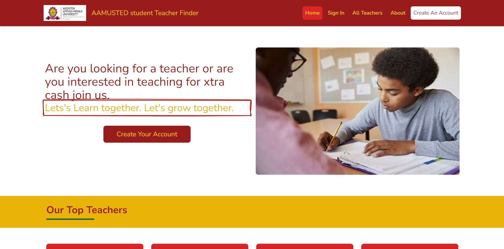
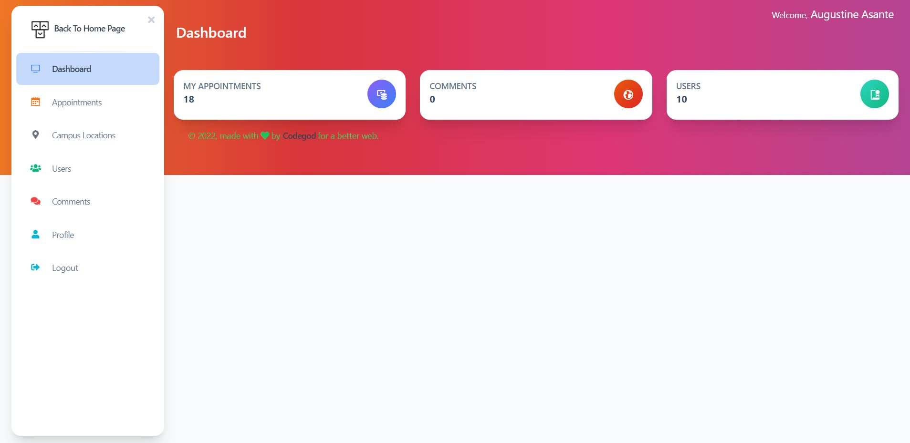
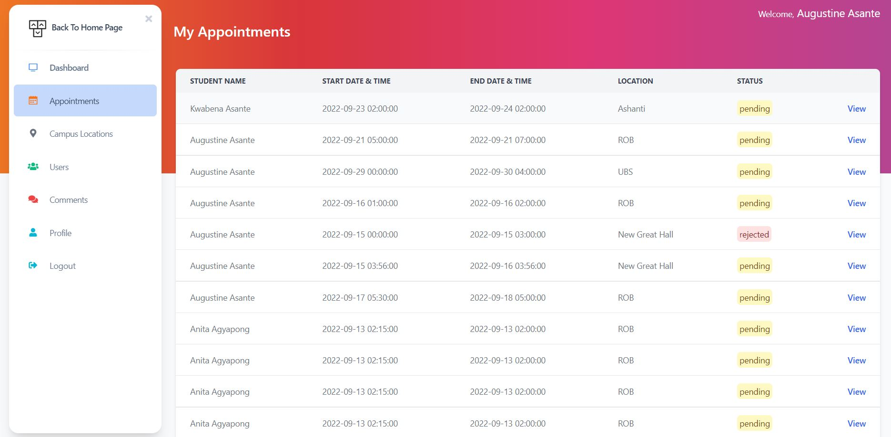
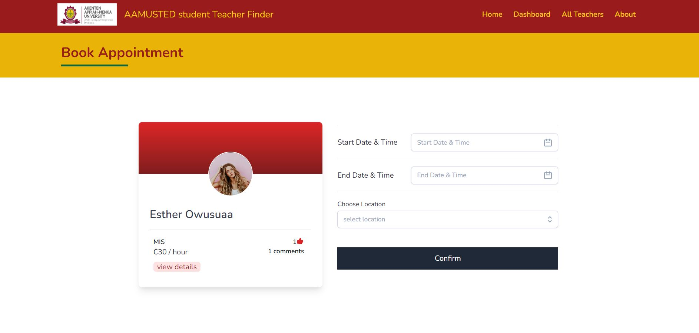
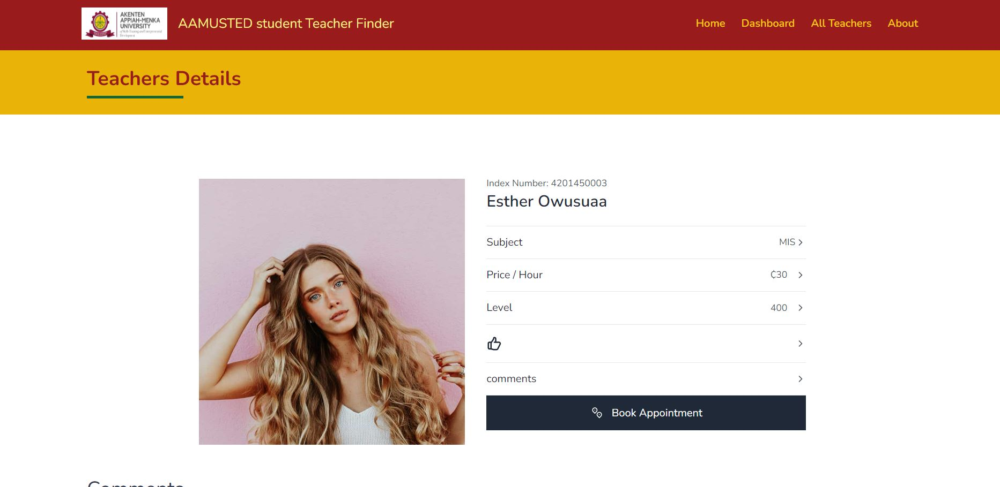

# Student Teacher Finder

The idea behind this app was to build a platform where students can find and book appointment with fellow students to teach them. This was built with laravel and it was made with love by ME.
It has 3 roles i.e Supa Admin, Students, and A teacher.

- The Supa Admin coordinates everything on the system and resolve dispute etc and approves students request to be a teacher on the platform.
- The Teacher is a student who has upgraded his or her account to be a teacher so that fellow students can book for his/her services.
- Student is a student who has just registered on the platform to book other peoples services.

### Built with
- TALL stack

### Features
- Send sms and email notifications
- Implemented Jobs and queues
- Book and cancel appointments etc.

## Find Some screenshots below

### Landing Page

 

 

### Dashboard Page

 

### Appointsments Page

 

### Book Appointment Page

 

### Teacher Details Page

 

